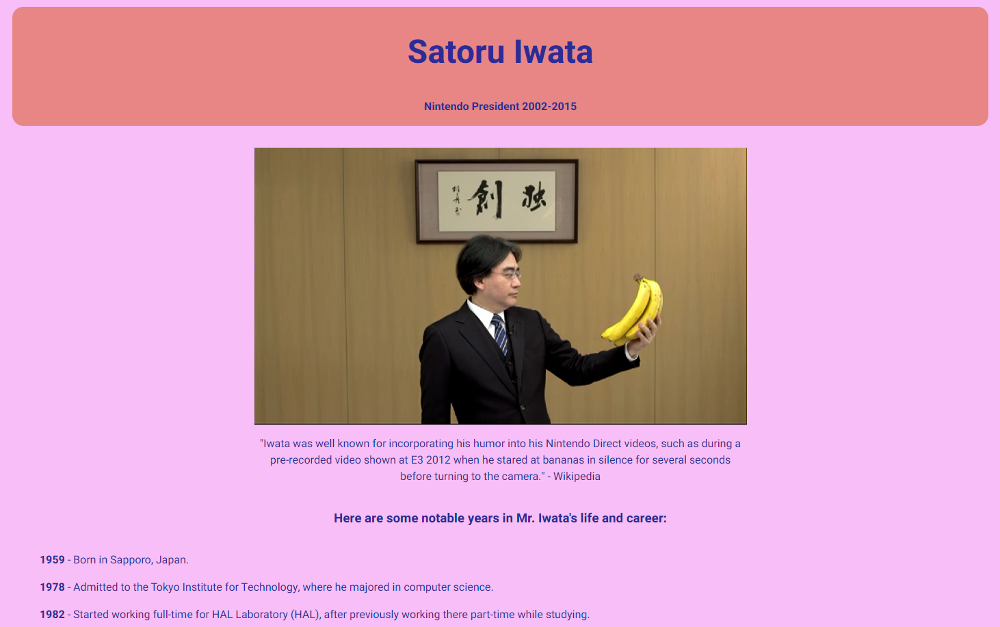

# Tribute Page

## FreeCodeCamp.org - (New) Responsive Web Design

This is a solution to the [Build a Tribute Page project](https://www.freecodecamp.org/learn/2022/responsive-web-design/build-a-tribute-page-project/build-a-tribute-page).

## Table of contents

- [Overview](#overview)
  - [The challenge](#the-challenge)
  - [Screenshot](#screenshot)
  - [Links](#links)
- [My process](#my-process)
  - [Built with](#built-with)
  - [What I learned](#what-i-learned)
  - [Continued development](#continued-development)
  - [Useful resources](#useful-resources)
- [Author](#author)
- [Acknowledgments](#acknowledgments)

## Overview

### The challenge

This is a simple tribute page that has responsive elements

### Screenshot

### Links

- Live Site URL: TBD

## My process

### Built with

- Semantic HTML
- CSS

### What I learned

Just trying to get back into the thick of things after a long while not coding anything.

### Continued development

Probably more responsiveness on the image and text of the list items.

## Author

- Website - [Joel P. Doctor](https://joeldoctor.com/)
- Frontend Mentor - [@kingwell47](https://www.frontendmentor.io/profile/kingwell47)
- Twitter - [@kingwell47](https://www.twitter.com/kingwell47)
- LinkedIn - [Joel P. Doctor](https://www.linkedin.com/in/joel-d-05854919/)

## Acknowledgments

Thanks to Ms. Jessica Chan (Coder Coder) and all the other YouTube creators making their knowledge available!
